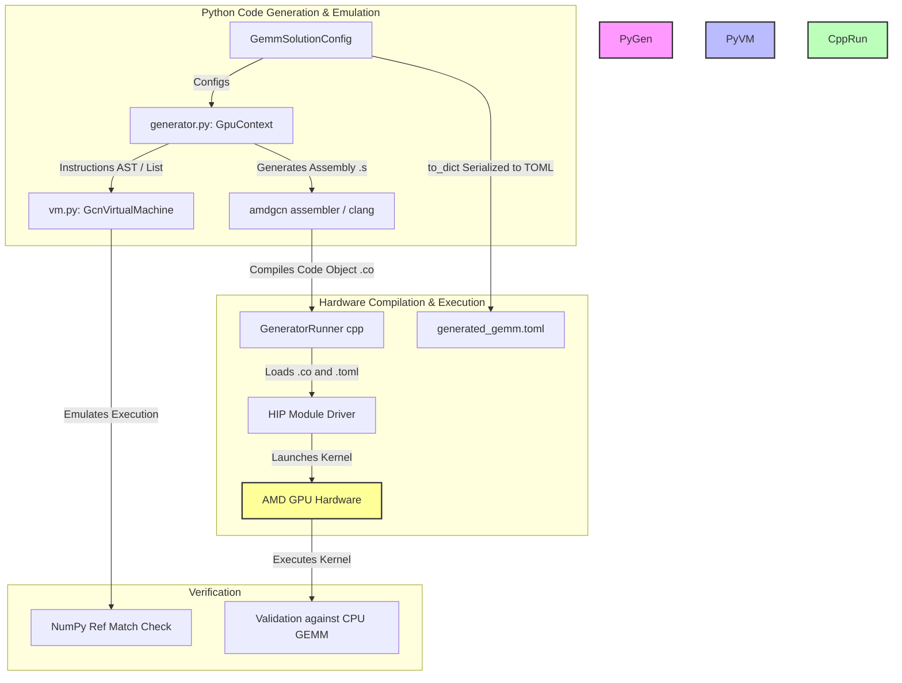

# Developer Agent Guide (AGENTS.md)

Welcome, agent! This guide is designed to help you quickly understand, develop, debug, and expand the **amdgpu-arch-gemm** repository. It highlights the architecture, critical APIs, the software simulation loop, and how to verify code changes without a physical AMD GPU.

---

## 1. High-Level Architecture

The following diagram illustrates how the code generation, compilation, execution, and emulation components interact.



---

## 2. Key Python Classes & Register Management

All generator structures are defined in [generator/generator.py](file:///home/serge45/amdgpu-arch-gemm/generator/generator.py).

### Registers and Ranges
AMDGPU assembly uses scalar, vector, and accumulator registers. These are represented by the following classes:
* **[Vgpr](file:///home/serge45/amdgpu-arch-gemm/generator/generator.py#L54)**: Vector General Purpose Register (`v[i]`).
* **[Sgpr](file:///home/serge45/amdgpu-arch-gemm/generator/generator.py#L58)**: Scalar General Purpose Register (`s[i]`).
* **[AccVgpr](file:///home/serge45/amdgpu-arch-gemm/generator/generator.py#L62)**: Accumulator Vector Register (`acc[i]`).
* **Ranges** (`VgprRange`, `SgprRange`, `AccVgprRange`): Represent a contiguous slice of registers (e.g. `v[0:3]`), which can be split using `.split(num_comp)` into individual registers or smaller sub-ranges.

### [GpuContext](file:///home/serge45/amdgpu-arch-gemm/generator/generator.py#L233)
The `GpuContext` acts as the builder for AMDGPU assembly. It records instructions, comments, labels, and tracks:
* `self.instructions`: A list of instruction tuples (e.g., `(callable, *args)`).
* `self.sgpr_counter`, `self.vgpr_counter`, `self.agpr_counter`: Used for automatic register allocation.
* Calling methods like `context.s_mov_b32(dst, src)` appends a representation of `s_mov_b32 dst, src` to the instruction list.

---

## 3. Software Virtual Machine Simulator

The **GCN Virtual Machine Simulator** ([vm/gcn_virtual_machine.py](file:///home/serge45/amdgpu-arch-gemm/vm/gcn_virtual_machine.py)) is one of the project's most powerful developer tools. It reads the instructions registered in a `GpuContext` and emulates them line by line in Python.

### Simulation Memory Models
* `smem`: Scalar Memory, simulating SMEM.
* `vmem`: Vector Memory, simulating VMEM.
* `lds`: Local Data Share, simulating LDS.
* State is stored using standard Python arrays and lists (e.g. `self.s` for SGPR state, `self.v` for VGPR state across `wavefront_size` threads).

### Running Tests
To verify instruction emission and emulation correctness:
```bash
PYTHONPATH=. pytest
```
Tests are located in:
* [test/test_sgemm.py](file:///home/serge45/amdgpu-arch-gemm/test/test_sgemm.py): Tests basic GEMM assembly generation.
* [test/test_vm.py](file:///home/serge45/amdgpu-arch-gemm/test/test_vm.py): Comprehensive unit tests verifying emulation correctness, including memory loads, math operations, and a full software $16\times 16$ or $32\times 32$ SGEMM simulation.

> [!TIP]
> Always run `PYTHONPATH=. pytest` after modifying the generator or VM. It performs instruction-level testing on simulated registers and virtual memories, catching bugs before they hit the GPU.

---

## 4. Playbook: Adding a New GCN Instruction

If you need to support a new GPU assembly instruction, follow this step-by-step checklist:

### Step 1: Define Generator Method in `GpuContext`
Add the instruction method in [generator/generator.py](file:///home/serge45/amdgpu-arch-gemm/generator/generator.py).
Ensure it records the instruction by registering it. For example:
```python
def v_add_f32(self, dst: Vgpr, src0: Vgpr | Sgpr | float, src1: Vgpr | Sgpr | float):
    # Register the instruction with its callback and arguments
    self.instructions.append((lambda: f"v_add_f32 {dst}, {src0}, {src1}", dst, src0, src1))
```

### Step 2: Implement Emulation Behavior in `GcnVirtualMachine`
Add a matching emulator method with the exact same name in [vm/gcn_virtual_machine.py](file:///home/serge45/amdgpu-arch-gemm/vm/gcn_virtual_machine.py):
```python
def v_add_f32(self, dst: Vgpr, src0: Vgpr | Sgpr | float, src1: Vgpr | Sgpr | float):
    # Obtain vector values for both sources (across the wavefront)
    val0 = self._get_v_inst_src_val(src0)
    val1 = self._get_v_inst_src_val(src1)
    
    # Emulate the instruction across the wavefront_size (typically 64 threads)
    for i in range(self.wavefront_size):
        # Decode FP32 bytes if needed, add, and store result
        # Note: self.v[dst.index] is a list of size wavefront_size
        f0 = struct.unpack("f", int.to_bytes(val0[i], 4, "little"))[0]
        f1 = struct.unpack("f", int.to_bytes(val1[i], 4, "little"))[0]
        res_bytes = struct.pack("f", f0 + f1)
        self.v[dst.index][i] = int.from_bytes(res_bytes, "little")
```

### Step 3: Add a Unit Test in `test_vm.py`
Add a unit test in [test/test_vm.py](file:///home/serge45/amdgpu-arch-gemm/test/test_vm.py) to exercise the new code paths:
```python
def test_v_add_f32():
    context = GpuContext()
    # Write test instructions in the context
    context.v_mov_b32(Vgpr(0), 1.5)
    context.v_add_f32(Vgpr(1), Vgpr(0), 2.5)
    
    # Initialize the virtual machine and execute
    vm = GcnVirtualMachine(104, 256, 64)
    vm.run(context)
    
    # Validate simulated registers
    for val in vm.v[1]:
        f_val = struct.unpack("f", int.to_bytes(val, 4, "little"))[0]
        assert abs(f_val - 4.0) < 1e-5
```

### Step 4: Verify
Run `PYTHONPATH=. pytest` and verify your new unit test passes.

---

## 5. Matrix GEMM Configuration Pipeline

The GEMM problem uses a serialized configuration file to bridge the Python generator and C++ driver.

1. **Generation**: `generator.py` compiles the assembly using the configuration in [GemmSolutionConfig](file:///home/serge45/amdgpu-arch-gemm/generator/generator.py#L836).
2. **Configuration Output**: It exports configuration details to a TOML file (e.g. `generated_gemm.toml`) containing keys like `mfma`, `wave_group`, `wave_tiling`, `depth_k`, and `lds_usage_bytes` using `tomli_w`.
3. **Hardware Execution**: The C++ runner ([runner/generator_runner.cpp](file:///home/serge45/amdgpu-arch-gemm/runner/generator_runner.cpp)) reads this TOML file to align arguments, calculate grid/block configurations, and set LDS sizes before calling `hipExtModuleLaunchKernel`.

> [!WARNING]
> If you add new configuration options in [GemmSolutionConfig](file:///home/serge45/amdgpu-arch-gemm/generator/generator.py#L836), you must also update:
> 1. The `to_dict` method inside `GemmSolutionConfig`.
> 2. The `AsmKernelConfig` struct and the `getAsmKernelConfig` parsing function in [runner/generator_runner.cpp](file:///home/serge45/amdgpu-arch-gemm/runner/generator_runner.cpp).
> Failing to align them will result in parsing errors or incorrect kernel launches on the GPU.

---

## 6. Development Tips for Agents

* **No-GPU Workspace**: You can implement, refactor, and test GCN assembly correctness on sandboxed CPU-only systems since the VM simulator supports the core logic checks.
* **Instruction Execution tracing**: To debug, you can add print statements to the instruction runner loop in [GcnVirtualMachine.run](file:///home/serge45/amdgpu-arch-gemm/vm/gcn_virtual_machine.py#L76) to trace exactly which simulated instructions are being run and inspect register values.
* **ROCm Toolchain Dependency**: The `compile` method in `generator.py` invokes `/opt/rocm/llvm/bin/clang++`. If your sandbox environment does not contain this path, assembly generation will still output raw `.s` code, but compilation to `.co` will fail. You can mock or handle this failure when building code object outputs in virtual environments.

---

## 7. High-Performance LDS Alignment & Scheduling Guidelines

To achieve maximum performance and prevent hardware stalls on AMD GPUs:

### LDS 16-Byte Vector Alignment
* **Rule**: LDS read and write strides (`tile_size[0] + pad_a` and `depth_k + pad_b`) **must be multiples of 4 elements** (16 bytes).
* **Rationale**: Vectorized loads and stores (like `ds_write_b128` and `ds_read_b128`) require 16-byte alignment. If strides are not multiples of 4 elements, reads/writes across thread lanes span memory banks in ways that trigger alignment stalls and instruction replays.
* **Implementation**: Keep candidate padding options constrained to multiples of 4 elements (e.g. `[0, 4, 8, 12, 16]`).

### Dynamic Thread Coordinate Mapping
* **Rule**: Ensure LDS padding solvers compute bank conflicts using the actual thread coordinates of the selected MFMA instruction rather than hardcoded 16x16 parameters.
* **Calculations**:
  * **Matrix A**: `t_row = wt & (mfma[0] - 1)`, `t_col = wt // mfma[0]`
  * **Matrix B**: `t_col = wt & (mfma[1] - 1)`, `t_row = wt // mfma[1]`

### Interleaved Scheduling Order
* **Rule**: When scheduling loop instructions, LDS reads must be issued **before** the compute (MFMA) instructions in the same step.
* **Rationale**: If a read is issued at the end of a step (e.g., after the MFMAs), it has 0 compute cycles in flight before the step-ending `s_waitcnt lgkmcnt(0)` barrier, forcing the CU to stall for the full 40-cycle LDS read latency. Issuing reads before MFMAs allows the MFMAs to hide the read latency during their execution.
