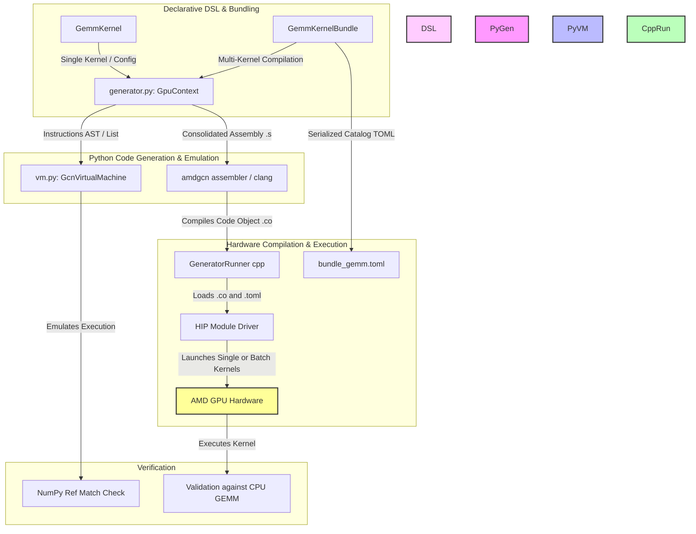

# Developer Agent Guide (AGENTS.md)

Welcome, agent! This guide is designed to help you quickly understand, develop, debug, and expand the **amdgpu-arch-gemm** repository. It highlights the architecture, critical APIs, the software simulation loop, multi-kernel bundling, and how to verify code changes without a physical AMD GPU.

---

## 1. High-Level Architecture

The following diagram illustrates how the declarative DSL, code generation, compilation, execution, and emulation components interact.


```mermaid
graph TD
    %% Define styles for clarity
    style DSL fill:#fcf,stroke:#333,stroke-width:2px
    style PyGen fill:#f9f,stroke:#333,stroke-width:2px
    style PyVM fill:#bbf,stroke:#333,stroke-width:2px
    style CppRun fill:#bfb,stroke:#333,stroke-width:2px
    style HW fill:#ff9,stroke:#333,stroke-width:2px

    %% Flow definition
    subgraph Declarative DSL & Bundling
        D0[GemmKernel] -->|Single Kernel / Config| B[generator.py: GpuContext]
        D1[GemmKernelBundle] -->|Multi-Kernel Compilation| B
    end

    subgraph Python Code Generation & Emulation
        B -->|Instructions AST / List| C[vm.py: GcnVirtualMachine]
        B -->|Consolidated Assembly .s| D[amdgcn assembler / clang]
    end

    subgraph Hardware Compilation & Execution
        D -->|Compiles Code Object .co| E[GeneratorRunner cpp]
        D1 -->|Serialized Catalog TOML| F[bundle_gemm.toml]
        E -->|Loads .co and .toml| G[HIP Module Driver]
        G -->|Launches Single or Batch Kernels| HW[AMD GPU Hardware]
    end

    subgraph Verification
        C -->|Emulates Execution| V[NumPy Ref Match Check]
        HW -->|Executes Kernel| H[Validation against CPU GEMM]
    end

    classDef python fill:#eef,stroke:#333,stroke-width:1px;
    classDef cpp fill:#efe,stroke:#333,stroke-width:1px;
```

---

## 2. Key Python Classes & Register Management

All generator structures are defined in [generator/generator.py](file:///home/serge45/amdgpu-arch-gemm/generator/generator.py) and [generator/dsl/](file:///home/serge45/amdgpu-arch-gemm/generator/dsl/).

### Registers and Ranges
AMDGPU assembly uses scalar, vector, and accumulator registers. These are represented by the following classes:
* **[Vgpr](file:///home/serge45/amdgpu-arch-gemm/generator/generator.py#L54)**: Vector General Purpose Register (`v[i]`).
* **[Sgpr](file:///home/serge45/amdgpu-arch-gemm/generator/generator.py#L58)**: Scalar General Purpose Register (`s[i]`).
* **[AccVgpr](file:///home/serge45/amdgpu-arch-gemm/generator/generator.py#L62)**: Accumulator Vector Register (`acc[i]`).
* **Ranges** (`VgprRange`, `SgprRange`, `AccVgprRange`): Represent a contiguous slice of registers (e.g. `v[0:3]`), which can be split using `.split(num_comp)` into individual registers or smaller sub-ranges.

### [GpuContext](file:///home/serge45/amdgpu-arch-gemm/generator/generator.py#L233)
The `GpuContext` acts as the builder for AMDGPU assembly. It records instructions, comments, labels, and tracks:
* `self.instructions`: A list of instruction tuples (e.g., `(callable, *args)`).
* `self.sgpr_counter`, `self.vgpr_counter`, `self.agpr_counter`: Used for automatic register allocation.
* Calling methods like `context.s_mov_b32(dst, src)` appends a representation of `s_mov_b32 dst, src` to the instruction list.

---

## 3. Software Virtual Machine Simulator

The **GCN Virtual Machine Simulator** ([vm/gcn_virtual_machine.py](file:///home/serge45/amdgpu-arch-gemm/vm/gcn_virtual_machine.py)) is one of the project's most powerful developer tools. It reads the instructions registered in a `GpuContext` and emulates them line by line in Python.

### Simulation Memory Models
* `smem`: Scalar Memory, simulating SMEM.
* `vmem`: Vector Memory, simulating VMEM.
* `lds`: Local Data Share, simulating LDS.
* State is stored using standard Python arrays and lists (e.g. `self.s` for SGPR state, `self.v` for VGPR state across `wavefront_size` threads).

### Running Tests
To verify instruction emission and emulation correctness:
```bash
PYTHONPATH=. pytest
```
Tests are located in:
* [test/test_bundle.py](file:///home/serge45/amdgpu-arch-gemm/test/test_bundle.py): Multi-kernel bundle compilation and canonical naming.
* [test/test_dsl_kernel.py](file:///home/serge45/amdgpu-arch-gemm/test/test_dsl_kernel.py): GEMM DSL interface tests.
* [test/test_sgemm.py](file:///home/serge45/amdgpu-arch-gemm/test/test_sgemm.py): Basic GEMM assembly generation.
* [test/test_vm.py](file:///home/serge45/amdgpu-arch-gemm/test/test_vm.py): Comprehensive unit tests verifying emulation correctness, including memory loads, math operations, and a full software $16\times 16$ or $32\times 32$ SGEMM simulation.

> [!TIP]
> Always run `PYTHONPATH=. pytest` after modifying the generator or VM. It performs instruction-level testing on simulated registers and virtual memories, catching bugs before they hit the GPU.

---

## 4. Playbook: Adding a New GCN Instruction

If you need to support a new GPU assembly instruction, follow this step-by-step checklist:

### Step 1: Define Generator Method in `GpuContext`
Add the instruction method in [generator/generator.py](file:///home/serge45/amdgpu-arch-gemm/generator/generator.py).
Ensure it records the instruction by registering it. For example:
```python
def v_add_f32(self, dst: Vgpr, src0: Vgpr | Sgpr | float, src1: Vgpr | Sgpr | float):
    # Register the instruction with its callback and arguments
    self.instructions.append((lambda: f"v_add_f32 {dst}, {src0}, {src1}", dst, src0, src1))
```

### Step 2: Implement Emulation Behavior in `GcnVirtualMachine`
Add a matching emulator method with the exact same name in [vm/gcn_virtual_machine.py](file:///home/serge45/amdgpu-arch-gemm/vm/gcn_virtual_machine.py):
```python
def v_add_f32(self, dst: Vgpr, src0: Vgpr | Sgpr | float, src1: Vgpr | Sgpr | float):
    # Obtain vector values for both sources (across the wavefront)
    val0 = self._get_v_inst_src_val(src0)
    val1 = self._get_v_inst_src_val(src1)
    
    # Emulate the instruction across the wavefront_size (typically 64 threads)
    for i in range(self.wavefront_size):
        # Decode FP32 bytes if needed, add, and store result
        # Note: self.v[dst.index] is a list of size wavefront_size
        f0 = struct.unpack("f", int.to_bytes(val0[i], 4, "little"))[0]
        f1 = struct.unpack("f", int.to_bytes(val1[i], 4, "little"))[0]
        res_bytes = struct.pack("f", f0 + f1)
        self.v[dst.index][i] = int.from_bytes(res_bytes, "little")
```

### Step 3: Add a Unit Test in `test_vm.py`
Add a unit test in [test/test_vm.py](file:///home/serge45/amdgpu-arch-gemm/test/test_vm.py) to exercise the new code paths.

### Step 4: Verify
Run `PYTHONPATH=. pytest` and verify your new unit test passes.

---

## 5. Matrix GEMM Configuration & TOML Schema

The GEMM problem uses a serialized configuration file to bridge the Python generator and C++ driver.

### Canonical Kernel Naming
Each kernel generates a canonical symbol name via `config.canonical_name`:
```
{precision}_{transA}{transB}_b{M}x{N}x{K}_wg{wg0}x{wg1}_wt{wt0}x{wt1}_{atom}_{lds_buf}_vs{stages}
```
Example: `sgemm_nn_b256x128x16_wg2x2_wt4x2_mfma32x32x2_sgl_vs2`.

### Single vs Multi-Kernel TOML Catalogs
* **Single Kernel (`generated_gemm.toml`)**:
  ```toml
  default_kernel = "sgemm_nn_b256x128x16_wg2x2_wt4x2_mfma32x32x2_sgl_vs2"
  [config]
  mfma = [32, 32, 1, 2]
  wave_group = [2, 2]
  wave_tiling = [4, 2]
  depth_k = 16
  lds_usage_bytes = 16384
  ...
  ```
* **Multi-Kernel Bundle (`bundle.toml`)**:
  ```toml
  default_kernel = "sgemm_nn_b256x128x16_wg2x2_wt4x2_mfma32x32x2_sgl_vs2"
  [kernels.sgemm_nn_b256x128x16_wg2x2_wt4x2_mfma32x32x2_sgl_vs2]
  mfma = [32, 32, 1, 2]
  ...
  [kernels.sgemm_nn_b128x256x32_wg2x2_wt2x4_mfma32x32x2_sgl_vs2]
  mfma = [32, 32, 1, 2]
  ...
  ```

### C++ Runner Parsing & Dispatch
[runner/generator_runner.cpp](file:///home/serge45/amdgpu-arch-gemm/runner/generator_runner.cpp) uses `getAsmKernelConfigs(toml_path)` to load single or multi-kernel files:
* If the user specifies `--all`, the runner iterates over all configurations in the TOML catalog, launching each kernel in-process using pre-allocated GPU VRAM buffers.
* If a specific kernel name is given, it looks up that kernel directly by symbol name.

> [!WARNING]
> If you add new configuration options in [GemmSolutionConfig](file:///home/serge45/amdgpu-arch-gemm/generator/generator.py#L836), you must also update:
> 1. The `to_dict` method inside `GemmSolutionConfig`.
> 2. The `AsmKernelConfig` struct and the `getAsmKernelConfig` parsing function in [runner/generator_runner.cpp](file:///home/serge45/amdgpu-arch-gemm/runner/generator_runner.cpp).

---

## 6. Multi-Kernel Bundling & Tuning Best Practices

Bundling multiple kernels into a single Code Object (`.co`) speeds up compilation and auto-tuning by an order of magnitude. Follow these rules when working with bundles:

### Rule 1: Evaluate Kernel Body Before Inspecting Register Pressure
When generating assembly in [GemmKernel.generate_assembly](file:///home/serge45/amdgpu-arch-gemm/generator/dsl/kernel.py):
* The kernel body callable `body()` must be evaluated **before** reading `context.sgpr_counter` or `context.vgpr_counter`.
* Rationale: The instruction generation executes during `body()`. Reading counters before evaluation leaves `meta.vgpr_count` at 0, causing `.amdhsa_next_free_vgpr` to be emitted as 0, which triggers `HSA_STATUS_ERROR_MEMORY_APERTURE_VIOLATION` on hardware.

### Rule 2: Namespacing Jump Labels in Assembly
* All assembly branch targets and jump labels must be prefixed with the kernel name (e.g. `.L_{name}_loop_k_begin`, `.L_{name}_skip_load_c`).
* Rationale: Multiple kernels in a bundle share a single assembly compilation unit. Non-prefixed labels cause assembler redefinition errors during `clang++` assembly.

### Rule 3: Single-Pass Metadata Consolidation
* A `.co` contains a single unified `.amdgpu_metadata` block with `.amdhsa.kernels` list entries for all bundled kernels.
* RoData constants for each kernel are consolidated into a shared `.rodata` section.

### Rule 4: In-Process GPU Buffer Reuse
* In `GeneratorRunner`, allocate GPU memory (`gpuA`, `gpuB`, `gpuC`, `gpuD`) once per process.
* Benchmark all kernels in the bundle consecutively without freeing and reallocating VRAM between runs.

---

## 7. High-Performance LDS Alignment & Scheduling Guidelines

To achieve maximum performance and prevent hardware stalls on AMD GPUs:

### LDS 16-Byte Vector Alignment
* **Rule**: LDS read and write strides (`tile_size[0] + pad_a` and `depth_k + pad_b`) **must be multiples of 4 elements** (16 bytes).
* **Rationale**: Vectorized loads and stores (like `ds_write_b128` and `ds_read_b128`) require 16-byte alignment. If strides are not multiples of 4 elements, reads/writes across thread lanes span memory banks in ways that trigger alignment stalls and instruction replays.
* **Implementation**: Keep candidate padding options constrained to multiples of 4 elements (e.g. `[0, 4, 8, 12, 16]`).

### Dynamic Thread Coordinate Mapping
* **Rule**: Ensure LDS padding solvers compute bank conflicts using the actual thread coordinates of the selected MFMA instruction rather than hardcoded 16x16 parameters.
* **Calculations**:
  * **Matrix A**: `t_row = wt & (mfma[0] - 1)`, `t_col = wt // mfma[0]`
  * **Matrix B**: `t_col = wt & (mfma[1] - 1)`, `t_row = wt // mfma[1]`

### Interleaved Scheduling Order
* **Rule**: When scheduling loop instructions, LDS reads must be issued **before** the compute (MFMA) instructions in the same step.
* **Rationale**: If a read is issued at the end of a step (e.g., after the MFMAs), it has 0 compute cycles in flight before the step-ending `s_waitcnt lgkmcnt(0)` barrier, forcing the CU to stall for the full 40-cycle LDS read latency. Issuing reads before MFMAs allows the MFMAs to hide the read latency during their execution.

